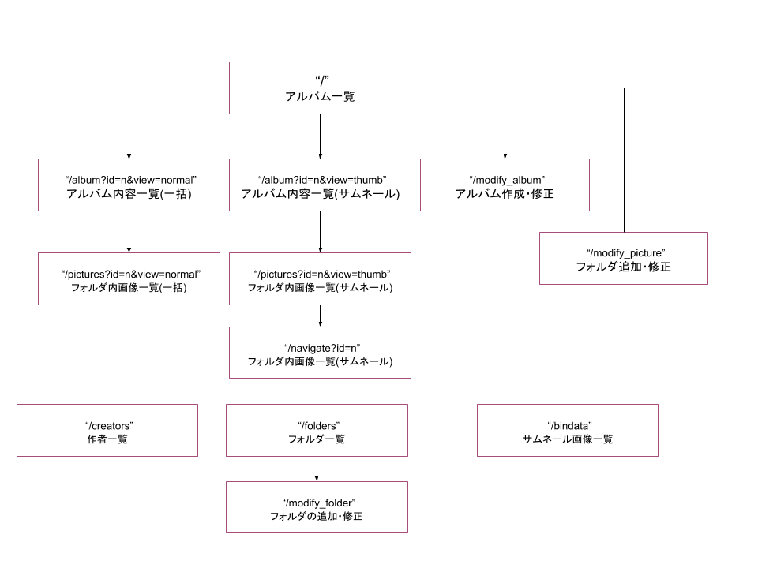

"# express PictureAlbum" 

#  1 アルバム一覧
##   1.1 route : "/"
##   1.2 メニュー
###    1.2.1 アルバムの作成・修正 -- アルバムを作成・修正・無効化する。
###    1.2.2 画像の追加・修正 -- 画像を追加・修正・無効化する。
###    1.2.3 アルバムグループの選択 -- 表示するアルバムグループの選択
###    1.2.4 最初・前へ・次へ・最後
###    1.2.5 画像フォルダ一覧
###    1.2.6 画像フォルダの追加・修正
###    1.2.7 サムネール画像フォルダ一覧

#  2 アルバム内容一覧(一括表示)
     id=n で指定されたアルバムに含まれる画像一覧 (一括表示)
##   2.1 route : /album?id=n&view=normal
##   2.2 メニュー
###    2.2.1 TOP -- アルバム一覧へ戻る。
###    2.2.2 サムネール表示
###    2.2.3 画像の追加・修正 -- 画像を追加・修正・無効化する。（新タブ）
###    2.2.4 画像の幅をウィンドウに合わせる。

#  3 アルバム内容一覧(サムネール表示)
     id=n で指定されたアルバムに含まれる画像一覧 (サムネール表示)
##   3.1 route : /album?id=n&view=thumb
##   3.2 メニュー
###    3.2.1 TOP -- アルバム一覧へ戻る。
###    3.2.2 一括表示
###    3.2.3 画像の追加・修正 -- 画像を追加・修正・無効化する。（新タブ）

#  4 画像フォルダに含まれる画像一括表示
   これは上の２または３で画像をクリックしたとき遷移するページである。
##   4.1 route : /pictures?id=n&view=normal
##   4.2 メニュー
###    4.2.1 TOP -- アルバム一覧へ戻る。
###    4.2.2 サムネール表示に切り替える
###    4.2.3 表示画像の幅をウィンドウに合わせる。
###    4.2.4 最初・前へ・次へ・最後

#  5  画像フォルダに含まれる画像サムネール表示
   これは上の 4.2.2 のメニューをクリックしたとき遷移するページである。
##   5.1 route : /pictures?id=n&view=thumb
##   5.2 メニュー
###    5.2.1 TOP -- アルバム一覧へ戻る。
###    5.2.2 一括表示に切り替える。

#  6  サムネールをクリックしたときのノーマル画像とナビゲーション
   これは上の５で画像をクリックしたとき遷移するページである。
##   6.1 route : /navigate?id=n
##   6.2 メニュー
###    6.2.1 TOP -- アルバム一覧へ戻る。
###    6.2.2 サムネール一覧表へ戻る。
###    6.2.3 画像の幅をウィンドウに合わせる。
###    6.2.4 最初・前へ・次へ・最後

#  7  アルバムの作成・修正
   これは上の1.2.1メニューをクリックしたとき遷移するページある。
##   7.1 route : /modify_album?id=n
##   7.2 メニュー
###    7.2.1 TOP -- アルバム一覧へ戻る。

#  8  画像の追加・修正
##   8.1 route : /modify_picture?id=n
##   8.2 メニュー
###    8.2.1 TOP -- アルバム一覧へ戻る。
###    8.2.2 

#  9 画像フォルダの追加・修正
##   9.1 route : /modify_folders?id=n
##   9.2 メニュー
###    9.2.1 TOP -- アルバム一覧へ戻る。

#  10 サムネール画像一覧
##   10.1 route : /bindata
##   10.2 メニュー
###    10.2.1 TOP -- アルバム一覧へ戻る。

